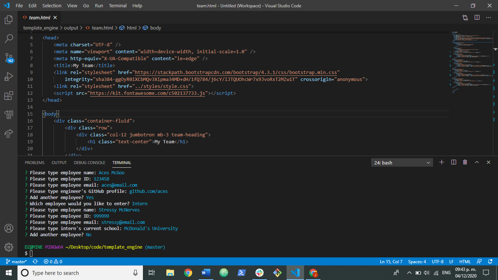
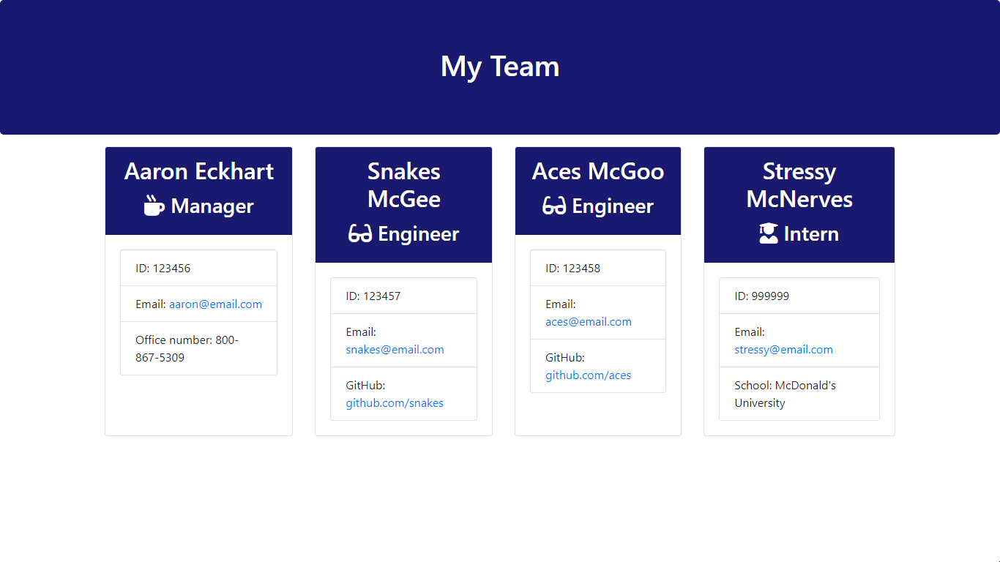

# template_engine

### Technologies
HTML

CSS

Javascript

Node.js

NPM

### Frameworks
Bootstrap

Font Awesome

### Purpose
Using the command line, you can create a roster of all members on your team,

which will be displayed in a neatly formatted webpage.

### Screenshots
Here's what the application looks like running in the terminal:

And here's the output HTML in a browser:

